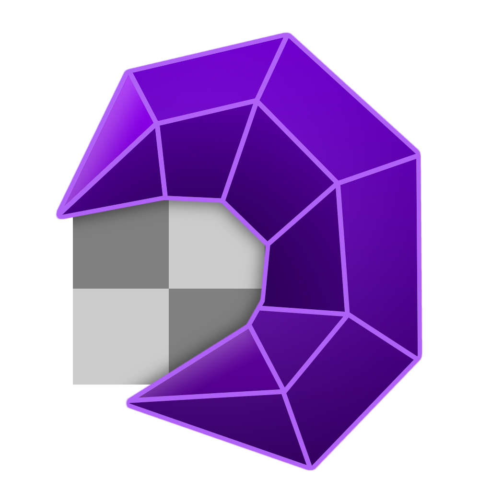
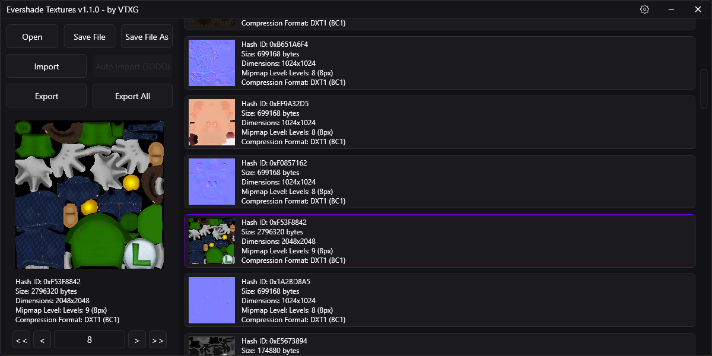
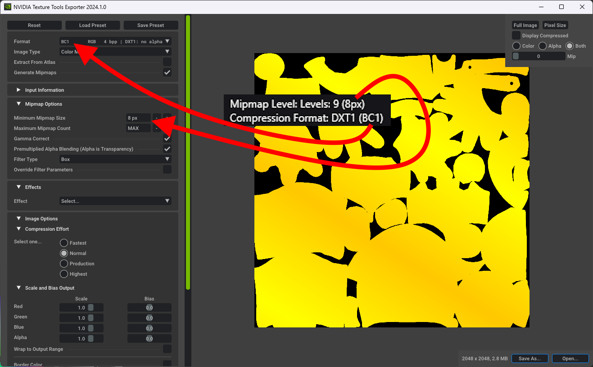

<h1 align="center">
  
   
  <b>Moon Extractor</b>
</h1>

  <b>Evershade Textures</b> is a texture importer and exporter for Luigi's Mansion 2 HD by VTXG.

 
 
 

# How to Use

### 0. Notes

Imported textures need to:
- have the same byte size as the original texture.
- have the same compression format.   

### 1. Opening and exporting a texture

Start by opening a **LM2HD Data file**. After that, select any texture and export it.  
  
See those values below the Texture Preview? They will be important for the next step.  

### 2. Editing and formatting a texture

Open and edit the DDS texture in any image editing software, and export it as a PNG image. 
Next, you will need [NVIDIA Texture Tools Exporter](https://developer.nvidia.com/texture-tools-exporter) to format your texture.  
 
*TIP: Generally, textures with no transparency use DTX1 (BC1), and textures with transparency use DTX5 (BC3).*  
After setting the values, export the texture as a DDS.  

### 3. Importing a texture

After that, click the import button and locate your texture. 
If you did everything correctly, it should work. You can now save the DATA file and test your mod!  

# Plans

- Settings (Light mode, NVTT location, etc.)
- Auto Import
- Texture Dimension Modification
